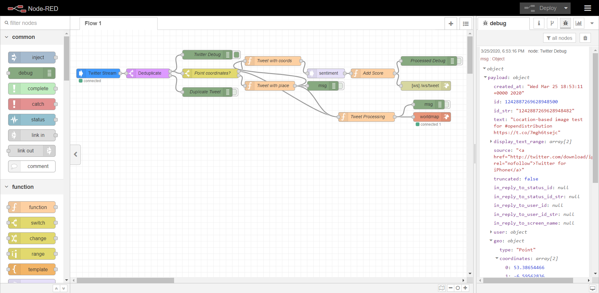

# twitter-hashtag-open-distribution
Node-Red flow enabling distribution requests via geolocated Tweet with relevant hashtag.

## Crowdsourcing information with hashtags and geolocated Tweets

1. In order to use Twitter to crowdsource information it is important for participants to [use specific hashtags](https://help.twitter.com/en/using-twitter/how-to-use-hashtags) (e.g. #opendistribution) that are easy to remember and can be used to aggregate and monitor submissions.
2. Participants can send geolocated Tweets from GPS enabled mobile phones. In order to do this they must...
  - Download the appropriate version of the Twitter app for their phone.
  - Enable GPS on their phone.
  - [Set up location settings in the twitter app](https://help.twitter.com/en/safety-and-security/twitter-location-services-for-mobile)
3. To geolocate a tweet...
  i) Start a tweet
  ii) Take the photo from within the Twitter app while composing the tweet
  iii) Select the location. Make sure this is the Geolocation and not one of the suggested 'Places'.
  iv) Don't forget to include the agreedhashtag the tweet.
  v) Send the Tweet.

Tip: Avoid sending the exact same or similar text repeatedly otherwise Twitter can ignore them as duplicates.

NOTE: As of 2019 Tweets can only be geolocated when a photo is attached, otherwise the API returns a Foursqaure 'Place' instead of a geolocation. See: https://9to5mac.com/2019/06/19/twitter-precise-location-tagging/ If the location settings in the phone or app are incorrect, or if the correct geolocation is not selected, the Twitter streaming API will report a 'Place'. The place will be accompanied with a geographic bounding box but this is often too large to be useful (the size of the town or city).
    
Further information on the parameters for filtering real-time tweets can be found in the documentation:
- [Standard streaming API request parameters](https://developer.twitter.com/en/docs/tweets/filter-realtime/guides/basic-stream-parameters)
- [Filtering Tweets by location](https://developer.twitter.com/en/docs/tutorials/filtering-tweets-by-location)

Be aware of the [Geo Guidelines](https://developer.twitter.com/en/developer-terms/geo-guidelines) provided by Twitter for developers.

## Setting up the flow in Node-Red

1. In order to use the Twitter Stream Node the user will need to sign up for a Twitter developer account and set up a Twitter app. See [Twitter developer apps: Overview](https://developer.twitter.com/en/docs/basics/apps/overview).
2. Install Node-Red as outlined in the [Getting Started](https://nodered.org/docs/getting-started/) guide. Node-Red can run locally on your Windows, Mac or Linux computer. It can also be run in Docker containers and deployed to cloud services like IBM Cloud, AWS and Microsoft Azure.
3. Import the nodes required by the flow using [Palette Manager](https://nodered.org/docs/user-guide/editor/palette/manager). You will need:
  - [node-red-contrib-twitter-stream](https://flows.nodered.org/node/node-red-contrib-twitter-stream): Provides access to the Twitter streaming API. 
  - [node-red-contrib-web-worldmap](https://flows.nodered.org/node/node-red-contrib-web-worldmap): Provides an interactive map for display for geolocated Tweets with associated pictures and videos.
  - [node-red-contrib-deduplicate](https://flows.nodered.org/node/node-red-contrib-deduplicate): Removes duplicates Tweets that might arise if Tweets reference multiple hashtags that are included in your API filter criteria (see below). 
4. Import the file `flows.json` from this repository using the Node-Red editor. See [Importing and Exporting Flows](https://nodered.org/docs/user-guide/editor/workspace/import-export).

5. Setup the Twitter Stream node:
  - Enter the Twitter app credentials created in step 1 above.
  - Select user accounts, hashtags or search terms to monitor.
  - Select any other filter criteria.
6. Check the settings in the WorldMap node. You can experiement with these later.
7. Deploy the flow. As Tweets are received any geolocated Tweets will be passed to the WorldMap. Other Tweets that do not have an explicit geolocation will be passed to one of the green debug nodes. Activate debug node by clicking the tab on the right to view the messages passed to them in the Node-Red [debug panel](https://nodered.org/docs/user-guide/editor/sidebar/debug).   
8. Press `CTRL` + `Shift` + `M` to display the map. Geolcated Tweets will appear on the map in real-time as they arrive.

Additional logic may be required to process data to meet specific use cases. This can be implemented using the [Core Nodes](https://nodered.org/docs/user-guide/nodes) which include a `function node` allows the use of JavaScript. The are also a large number of user contributed nodes and flows in the Node-Red [Flow Library](https://flows.nodered.org/). These include nodes enabling connection to a numerous databases, APIs and webservices using a range of different communication and networking protocols.
